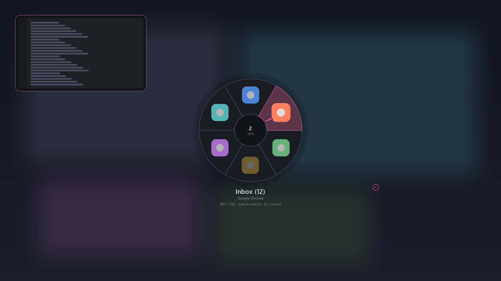
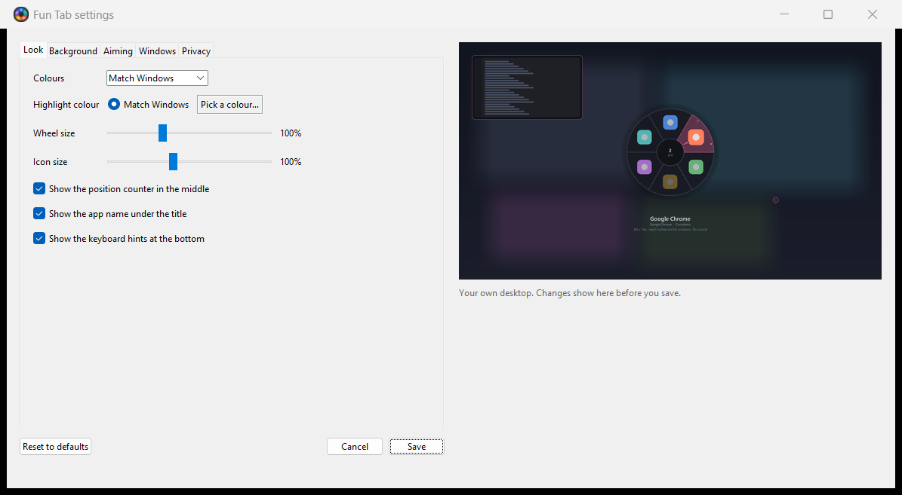

# Fun Tab

A GTA-style radial **Alt+Tab** for Windows. Hold Alt, tap Tab, flick the mouse at the app you want, let go of Alt.

It replaces the Windows switcher while it runs, and it is built to be faster than the thing it replaces: a warm open paints in about **12 ms**, and transitions run at the full refresh rate of the monitor.



Requires **Windows 10 or 11**. Other people do not need Python.

### Give it to people

On a machine that has Python 3.10+:

```bat
build.bat
```

That writes `dist\FunTab.zip`, and `dist\FunTabSetup.exe` if [Inno Setup 6](https://jrsoftware.org/isinfo.php) is installed. They can run the setup (Start Menu + optional desktop shortcut, no `_internal` folder to keep) or unzip the zip and double-click **FunTab.exe**. Keep `_internal` next to the exe if you use the zip — it is not optional. The first start can trip SmartScreen because the exe is unsigned; *More info* → *Run anyway*.

A tagged GitHub release (`v0.4.0` and so on) builds both files automatically.

A tray icon appears (look behind the **^** arrow on the taskbar if Windows hid it). Click it for **Settings**, or quit from there when you're done. Running Fun Tab again also asks whether to quit, which is the way out if the icon is missing. `install_desktop_shortcut.bat` puts a shortcut on the desktop (the packed exe if you have built it, otherwise the source launcher).

### Run from source

```bat
pip install -r requirements.txt
run.bat
```

`run.bat` installs those packages if they are missing, then starts the tray app. This is the developer path, not the copy you hand out.

## Controls

Everything below works while Alt is held. Release Alt to switch.

| Input | Action |
|---|---|
| **Open shortcut** | Configurable in Settings (default Alt+Tab). Supports key chords and mouse side-buttons (Mouse 4 / 5) |
| **Alt+Tab** | Opens the wheel when that is the open shortcut |
| **Alt+Shift+Tab** | Open going backwards (when the open shortcut is Alt+Tab) |
| **Ctrl+Alt+Tab** | Sticky open; also the fallback while game compatibility owns Alt+Tab |
| **Alt+`** | Open with the current app's windows already fanned out |
| **Flick the mouse** | Aim by direction from wherever the cursor already is - no need to drag it to the wheel first |
| **Point at a slice** | With the cursor actually on the ring, it picks whatever it's over |
| **Reach past the ring** | Fans out that app's windows on an outer band - angle picks the app, distance picks the window. Pull back for apps again |
| **Needle in the hub** | Shows the direction you're aiming, whenever the mouse has control |
| **Ring on the desktop** | Marks the spot your aim is measured from |
| **Tab / Shift+Tab** | Next / previous |
| **Arrows** | Next / previous |
| **Mouse wheel** | Next / previous |
| **1**-**9**, **0** | Jump straight to that slice and switch immediately |
| **Type any letters** | Filter the wheel by window title, app name or executable |
| **Backspace** | Edit the filter |
| **Home / End** | First / last window |
| **`** | Step through the windows of the selected app, in the outer band |
| **Enter**, **Space**, **left click** | Switch to the selection (a click anywhere counts) |
| **Enter on a pinned app that isn't running** | Starts it |
| **Right click a slice** | Hide this app, pin, close, or minimise |
| **Delete**, **Ctrl+W**, **Ctrl+Q** | Close the selected window, keep the wheel open |
| **Ctrl+M** | Minimise the selected window |
| **Ctrl+H** | Hide this app from the wheel (saved in Settings) |
| **Ctrl+P** | Pin / unpin this app - gives it a fixed place on the wheel |
| **Esc** | Clear the filter, or cancel if there is no filter |

Windows are ordered most-recently-used first, so Alt+Tab always lands on the app you came from and Alt+Tab+Tab lands on the one before it. With **one slice per application** (on by default) that second step is the previous *app*, not another window of the same one. Press `` ` `` to step through that app's windows; typing a filter expands matches so you can pick a specific title.

Slices are grouped by the same identity the taskbar uses (AppUserModelID), not by executable, so two Chrome profiles are two slices exactly as they are two taskbar buttons. Apps that declare no identity of their own - most plain Win32 ones - fall back to the executable.

### Distance picks the window, angle picks the app

A grouped slice used to be a dead end: it said "Chrome, 3 windows" and the only way in was the keyboard. Reach *past* the ring and that app's windows fan out on an outer band, so one continuous movement chooses both - flick to aim at the app, push a little further to choose which of its windows, pull back to change your mind. A dot per window on each slice's rim tells you which slices have anything out there before you go looking.

Radial distance was the one input the wheel was measuring and throwing away; `aim` used it only to ignore the hub. Spending it on depth costs nothing you were using.

Two details do most of the work. The band **latches** which app it belongs to when you enter it, because once you are out there the angle is choosing a window, and letting it keep choosing the app as well would change both at once. And entering and leaving use **different radii** (1.30 and 1.12 of the ring), because a single threshold makes the whole band flicker open and shut while the cursor rests near it.

The fan deliberately **overhangs its slice**. Confining it to the slice's own span sounds tidier, but a three-window app on a crowded wheel would get under six degrees per entry - legible and unusable at the same time.

The one real cost is the canvas: drawing outside the ring means a surface about 60% larger, which takes a selection change from 0.7 ms to 1.3 ms. Held frames are unaffected, because those only re-present the bitmap. Setting `subring` to `false` gives back the exact old canvas size.

### Pinned apps have a fixed direction

Pinning used to mean "sorted nearer the front", which only helped if the app was already running and still moved as the list moved. A pinned app now gets a **fixed slot at the bottom of the wheel**, at the same angle every time, whether or not it is open - and selecting one that isn't open starts it. That makes the direction learnable, which is the whole point: Spotify is down-left, always, and getting to it is a flick rather than a search.

Pinned slots aren't built from the window list at all. They're a second source read from your config and merged in at layout time, which is exactly why a closed app still renders: nothing ever asked Windows whether it exists. A closed slot shows a desaturated icon and a dashed rim, so "will launch" and "will switch" are tellable apart without reading anything - mistaking one for the other trades a 14 ms switch for an unexpected cold start.

The lane sits at 6 o'clock and the open windows share whatever arc is left, separated by an empty gap. Some alternatives that didn't survive:

- **A second ring further out** for pins - but that is where the window fan now lives, and two meanings for "further out" is one too many.
- **A lane between the hub and the ring** - too little arc length at that radius to flick at, and it boxes in the hub.
- **A drawn divider** instead of a gap - a line reads as decoration, a gap reads as two regions.
- **A fixed number of slots**, so angles never move at all - but a permanently reserved half-wheel is a bad trade for users with no pins, and the lane is capped at half the wheel anyway so that closed apps never get wider targets than the windows you're actually using.

Straight up stays slice 0 for every window count. With the lane symmetric about 6 o'clock the free arc is symmetric about 12 o'clock, which makes 12 o'clock a slice *centre* for odd counts and a *seam* for even ones; for even counts the free arc is divided into one more slot than there are windows and the spare is left empty. The gap lands beside slice 0, where it reads as the boundary between the newest and oldest window.

### Mouse and keyboard don't fight

Aiming is measured from wherever the cursor was when it last had control, not from the middle of the screen, so a flick works the same with the pointer parked in a corner. Measuring from the wheel's centre instead meant the corner your pointer happened to be in had already chosen a slice for you, and reaching the others meant dragging the cursor across the display.

The pointer also only has control while it's actually moving. Anything discrete - Tab, an arrow, a digit, the scroll wheel, typing a filter - takes the wheel back and re-anchors on the cursor, so a stationary mouse can't undo your keypress and a knock of the desk can't either. Move it deliberately and it takes over again.

Because the aim comes from a direction rather than a position, two markers show you what that direction is measured from and where it currently points. Both can be turned off in Settings.

A **needle** in the hub shows where you're pointing. It only appears while the pointer has control, so it never disagrees with the highlight, and it sits in the gap between the hub and the icons - a full-length ray would strike through the icon of the very slice you're choosing. Repainting it writes only that band back into the layered surface, so tracking the cursor costs **1.9 ms** a frame against 0.9 ms for sitting still; re-packing the whole canvas for it would cost 7 ms.

A small **ring** sits on the desktop at the pivot - where the cursor was when the wheel opened. It greys out rather than disappearing when a keypress takes control, because a marker that vanished every time you pressed Tab would answer "where is my aim measured from" only when you weren't asking. It lives in its own tiny layered window under the wheel, so moving it costs nothing and it can never cover a slice.

## What makes it fast

Idle cost is genuinely zero: a low-level keyboard hook wakes the process on key events, the overlay windows stay hidden, and the message loop sleeps on a 1-second timeout until the wheel is open.

When you do open it, the work has mostly already been done:

- **Everything paintable is cached and content-keyed.** Wedges, the hub, labels, icon sizes and whole composed frames are all keyed by what's in them, so cycling between two apps repaints nothing at all - a settled frame is served from cache and only handed to the compositor.
- **Startup prewarms the caches** on the UI thread: icons, executable names, the ring plate and each slice's highlight are built before your first Alt+Tab, not during it.
- **The backdrop blur starts when you press Alt, not when you press Tab.** Reading the framebuffer back costs ~32 ms at 1080p however small a plate it is scaled into - it's the screen-DC access, not the pixel count - which is more than everything else an open does put together. Alt always lands before Tab, so the capture runs on a worker thread during that gap and the open finds a finished plate: **0.0 ms** on the critical path. It's then blurred at 1/6 resolution and stretched back up by the driver, which costs about 2 ms rather than the 30-odd a screen-sized layered upload would.
- **The open animation is free.** Fading and rising are both parameters of `UpdateLayeredWindow`, so the animation never touches a pixel - it re-presents the same bitmap at a new offset and opacity.
- **One persistent DIB per window.** The old renderer allocated a DC, a bitmap and a `bytes` copy every frame; each window now keeps one DIB section alive and frames are packed straight into it in a single pass (Pillow's `BGRa` packer does the premultiply and the channel swap together).
- **Window previews are captured on a background thread**, newest request first, and reused for a few seconds before being refreshed.

Render costs from `bench.py`, best of three runs on a 1080p laptop:

| | 5 windows | 20 windows |
|---|---|---|
| First open after the startup prewarm | 1.5 ms | 1.1 ms |
| Re-open, same window set | 0.00 ms | 0.01 ms |
| Re-open, order changed | 1.3 ms | 0.7 ms |
| Transition frame | 0.8 ms | 0.8 ms |
| Held frame | 0.00 ms | 0.3 ms |
| Cold start, nothing cached at all | 19 ms | 20 ms |

End to end against real windows at 120 dpi (`smoke.py`), which adds the Win32 calls and the DIB uploads the table above leaves out: first open **~19 ms**, re-open with hot caches **~14 ms**, held frame **1.2 ms**. Resolving the backdrop at open is **0.0 ms**, because the 35 ms capture already ran while Alt was held.

Take the absolute values with a pinch of salt - this laptop's clocks swing by 2-3x depending on thermal state, so only same-run comparisons mean much.

## Settings

Click the tray icon for a settings window. Everything in it is in plain language, and the panel on the right is **a preview of your own desktop** - the real screenshot, the real window list, put through the same blur the switcher uses - so you can drag the blur slider and watch what it does rather than guess. Save applies it: the running switcher notices the file changed and reloads on its own, no restart and no **Reload settings**.



The screenshot above is a demo scene (fake wallpaper, fake apps), not anyone's real desktop.

It hashes the file rather than watching its timestamp, because Windows only moves file times on about a 16ms tick and two quick saves of a same-sized file can share one.

### The file

Everything still lives in `%APPDATA%\fun-tab\config.json`, written with defaults on first run, and hand-edits apply the same way the window's do. The window shows the settings worth changing; the table below is the full set. Unknown keys are ignored and out-of-range values are clamped, so a bad edit can't stop it from starting.

| Key | Default | Notes |
|---|---|---|
| `theme` | `"auto"` | `auto` follows the Windows app theme; or `dark` / `light` |
| `accent` | `"system"` | Follows your Windows accent colour, or set `"#RRGGBB"` |
| `scale` | `1.0` | Extra size multiplier on top of monitor DPI |
| `outer_radius`, `inner_radius` | `165`, `52` | Ring geometry, in 96-dpi pixels |
| `icon_scale` | `1.0` | Icon size within each slice |
| `backdrop` | `"blur"` | `blur` (frozen, blurred desktop), `dim` (frozen and darkened, not blurred), or `none` |
| `appear_duration` | `0.11` | Seconds for the open animation |
| `transition_duration` | `0.13` | Seconds for the selection crossfade |
| `max_fps` | `144` | Frame cap while the wheel is open |
| `dim_blur`, `dim_veil`, `dim_scale` | `1.0`, `40`, `6` | Backdrop softness, darkening, and capture resolution divisor |
| `backdrop_ttl` | `0.5` | Seconds a captured backdrop is reused before it's grabbed again |
| `preview_enabled` | `true` | The live preview card |
| `preview_position` | `"top-left"` | `top`/`bottom` + `left`/`right`/`center` |
| `preview_width`, `preview_height`, `preview_margin` | `400`, `225`, `48` | Card size and screen inset |
| `prefetch_previews` | `false` | Capture other windows in the background too |
| `capture_minimized` | `false` | Restore minimised windows off-screen to preview them |
| `thumb_ttl` | `4.0` | Seconds before a captured preview is refreshed |
| `aim_needle` | `true` | The needle in the hub showing which way you're aiming |
| `aim_origin` | `true` | The ring marking the spot your aim is measured from |
| `show_counter`, `show_subtitle`, `show_hints` | `true` | Hub text: `n/N`, app name, key hints |
| `title_privacy` | `"full"` | `full` shows window titles; `app` shows application names only |
| `privacy_mode` | `false` | Forces the privacy preset (no previews/prefetch/minimised capture/close keys; app labels) |
| `mru_order` | `true` | Most-recently-used ordering |
| `group_by_app` | `true` | One slice per application (by AppUserModelID, falling back to executable); `` ` `` steps through that app's windows |
| `group_pips` | `true` | A dot per window on each slice's rim |
| `subring` | `true` | Reach past the ring to fan out the aimed app's windows |
| `subring_enter`, `subring_exit` | `1.30`, `1.12` | Multiples of `outer_radius` at which the fan opens and closes. Different on purpose: one threshold chatters |
| `subring_min_degrees` | `12` | Floor on a fan entry's width, so a crowded wheel still gives flickable targets |
| `subring_new_window` | `true` | Offer "new window" as the last fan entry of a pinned app |
| `search_enabled`, `digit_jump`, `close_key_enabled` | `true` | Turn off the typing, number and close bindings |
| `close_confirm` | `true` | Ask before the first Delete/Ctrl+W close each session |
| `wrap_navigation` | `true` | Cycling past the end wraps around |
| `minimized_last` | `false` | Push minimised windows to the end of the wheel |
| `exclude_exes` | `[]` | e.g. `["teams.exe"]` - never show these (password managers are always excluded). Also edited as **Hidden apps** in Settings. |
| `pinned_exes` | `[]` | e.g. `["spotify.exe"]` - the pinned apps in slot order. The friendly way to write pins, and what **Pinned apps** edits in Settings; kept in step with `slots` |
| `slots` | `[]` | What the lane actually reads. One entry per pin: `{"index": 0, "exe": "spotify.exe", "aumid": "...", "launch": "...", "label": "Spotify"}`. Only a way to recognise the app is required; `launch` is recorded when you pin and is what gets started when the app is closed. Max 8 |
| `pin_lane` | `true` | Give pinned apps fixed slots at the bottom of the wheel |
| `pin_slot_degrees` | `30` | Arc per pinned slot. The lane as a whole is capped at 180° |
| `pin_gap_degrees` | `6` | Empty arc separating the lane from the open windows |
| `exclude_titles` | `[]` | Substring match on window titles |
| `open_hotkey` | `"alt+tab"` | Open chord: `alt+tab`, `ctrl+alt+tab`, `mouse4`, `ctrl+mouse5`, … |
| `open_sticky` | `false` | Keep the wheel open after releasing the open shortcut |
| `pause_in_games` | `true` | Uninstall input hooks while a game is in front (strongest anti-cheat option short of quitting) |
| `game_compat` | `"auto"` | `auto` steps aside when a game is in front, `always` always leaves plain Alt+Tab alone, `off` takes Alt+Tab when that is the open shortcut |
| `game_exes` | `[]` | Extra executable names auto-mode treats as games |
| `consent_version` | `0` | First-run disclosure; bumped when the consent text changes |
| `colors` | `{}` | Override any palette key, e.g. `{"accent": "#ff8800", "text": "#ffffff"}` |

## Tray menu

Windows 11 often hides a new icon behind the **^** arrow next to the clock. Fun Tab leaves it there and shows a balloon the first time it starts.

- **Settings…** - the settings window, with the live preview (also a left click)
- **Start with Windows** - adds Fun Tab to the per-user Run key (`FunTab.exe` from a packed build, or a `pythonw` shim from source)
- **Pause Fun Tab** - uninstalls the keyboard and mouse hooks until you resume; the tray icon stays, labelled *paused*
- **Edit the settings file** - opens `config.json` for the keys the window doesn't show
- **Reload settings** - forces a reload; saving already does this on its own
- **About Fun Tab** - version number
- **Quit Fun Tab**

If the icon is missing, run Fun Tab again and choose **Yes** when it asks to quit.

## Development

```bat
build.bat                   # dist\FunTab\FunTab.exe, dist\FunTab.zip, and FunTabSetup.exe if Inno Setup is installed
python -m pytest            # tests, no display needed
python bench.py             # render timings, cold and warm
python smoke.py             # creates real layered windows and times a live open
python backdrop_probe.py    # screenshots the backdrop and checks it isn't a flat tint
python live_check.py        # installs the real hook, sends a real Alt+Tab, screenshots it
python settings_check.py    # edits and saves in the real settings window, checks it applies
python -m fun_tab.settings_ui              # the settings window on its own
python -m fun_tab.settings_ui --demo --screenshot=assets/settings-window.png
python -m fun_tab.preview --scene --out=assets/fun-tab-open.png
```

`preview.py` renders the wheel and preview card to a PNG without installing the keyboard hook, which is the quickest way to iterate on the look. Its `ScenePreview` is what the settings window shows, and it shares the backdrop treatment with the overlay (`treat_plate`) so the two can't drift apart.

Live check and backdrop probe scripts write PNGs next to the repo. Those files are gitignored — do not commit them; they are captures of the machine that ran the check.

## Notes and caveats

- The backdrop is a frozen capture on purpose, not DWM acrylic. Both DWM routes - the legacy accent policy and Windows 11's `DWMWA_SYSTEMBACKDROP_TYPE` - return success on a full-screen topmost window and then composite a flat tint with no trace of the windows behind it, which is where the "backdrop turns black" bug came from. `backdrop_probe.py` screenshots each variant if you want to check your own build.
- Capture is unavailable on some remote sessions; those fall back to a plain translucent veil.
- Works with borderless and windowed games. Exclusive fullscreen can block any overlay.
- Only one instance runs at a time.
- **Anti-cheat:** Fun Tab installs a global keyboard hook (`WH_KEYBOARD_LL`), a mouse hook for side-buttons, and a topmost overlay. It is not a cheat and never reads another process's memory, but hooks and overlays alone can trip heuristics. **Pause Fun Tab completely while a game is in front** (on by default) uninstalls those hooks for as long as a game is focused — that is the strongest option short of quitting from the tray before launch. Game compatibility mode separately leaves native Alt+Tab alone when a game is in front.

## License

[MIT](LICENSE)
